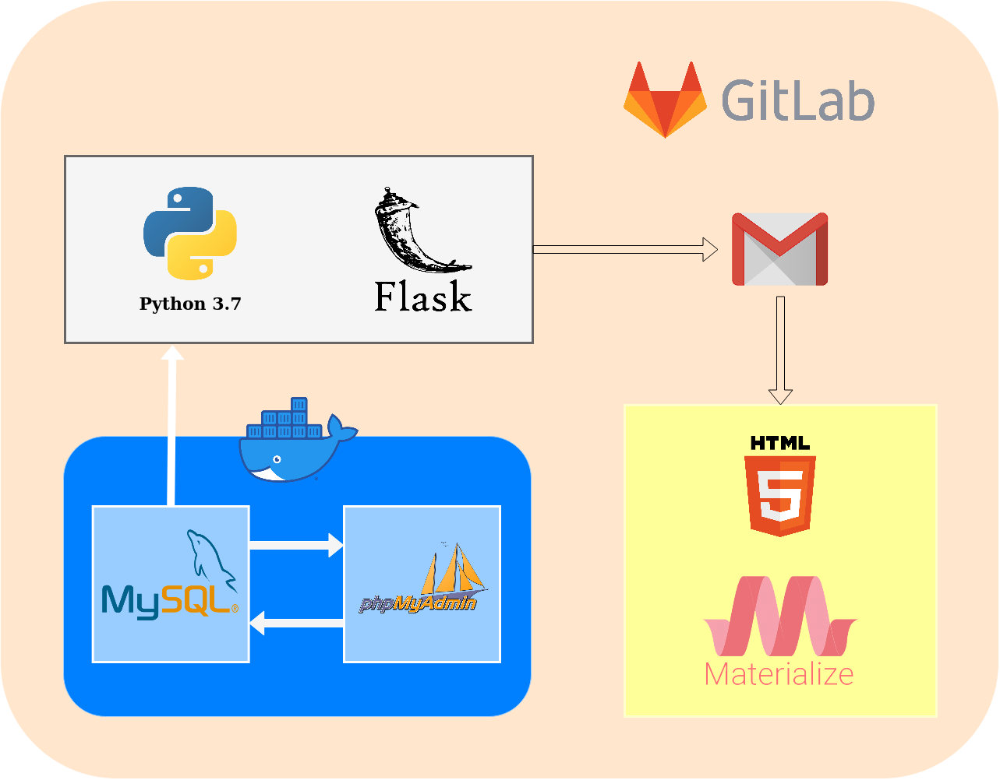
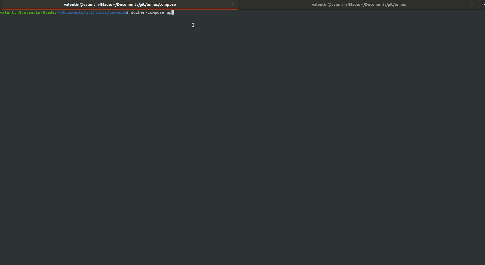
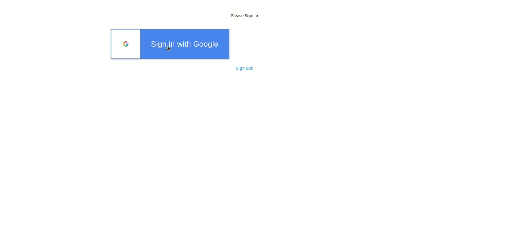

# Lumos
ECV Hackathon Project


```
________________________   ____ ________  .___  ________.___________________  .____     
\_   _____/\_   ___ \   \ /   / \______ \ |   |/  _____/|   \__    ___/  _  \ |    |    
 |    __)_ /    \  \/\   Y   /   |    |  \|   /   \  ___|   | |    | /  /_\  \|    |    
 |        \\     \____\     /    |    `   \   \    \_\  \   | |    |/    |    \    |___ 
/_______  / \______  / \___/    /_______  /___|\______  /___| |____|\____|__  /_______ \
        \/         \/                   \/            \/                    \/        \/
```




## Run BDD Env manuel :
RUN docker mysql image 

`docker run --name=my_mysql -v /home/valentin/Documents/git/lumos/compose/dockerVolume:/var/lib/mysql --env="MYSQL_ROOT_PASSWORD=root" -p 3306:3306 -d mysql`

RUN docker phpmyadmin image :

`docker run --name myadmin -d --link my_mysql:db -p 8081:80 phpmyadmin/phpmyadmin`

## Run BDD Env Auto :

```
$ cd ./compose
$ docker-compose up --build
```

## Création de la BBD + User 
(If BDD not already exist in docker volume)

RUN bash inside the container :

`docker exec -it my_mysql mysql -uroot -proot`

Une fois à l'intérieur, création d'un user (% => donne les droits partout) :

```
$ CREATE USER 'valentin'@'%' IDENTIFIED BY 'root';
$ CREATE DATABASE lumos;
$ GRANT ALL PRIVILEGES ON lumos.* to 'valentin'@'%';
```

## Finaly

Run the flask project with :`flask run`
(Run flask as debug mode : `export FLASK_ENV=development`)

PhpMyAdmin is up at : `localhost:8081`

Flask project is up at : `localhost:5000`



## Connection via Gmail

Récupération de l'API google via un token utilisateur et affichage des information



